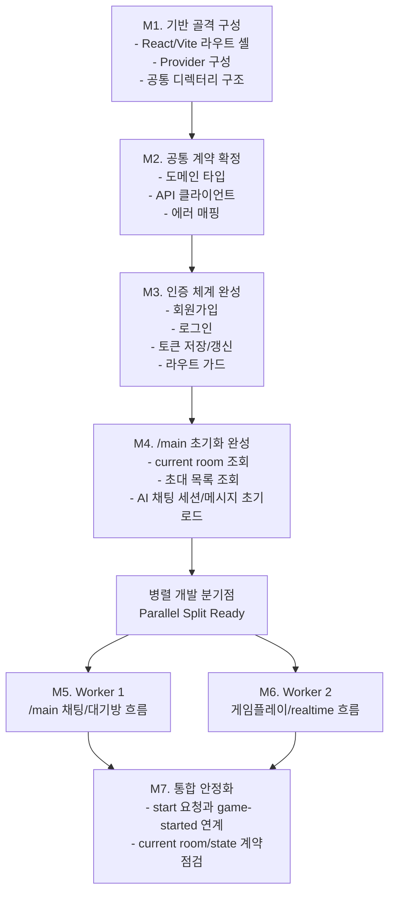
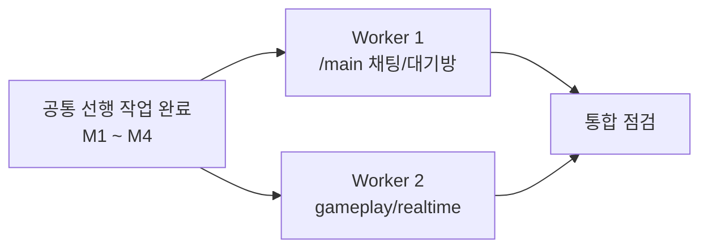

# 프론트엔드 구현 마일스톤

## 문서 목적

이 문서는 `docs/plans` 기준으로 프론트엔드 구현 작업을 테크 리더가 빠르게 파악할 수 있도록
선행 작업, 병렬 분기 시점, 완료 기준을 마일스톤 중심으로 정리한 문서입니다.

핵심 원칙은 다음과 같습니다.

- 초반에는 공통 기반 작업을 순차적으로 마무리한다.
- `/main` 초기화 완료 시점을 병렬 개발 시작 기준으로 삼는다.
- 이후 작업은 Worker 1, Worker 2로 나누어 독립적으로 진행한다.
- 게임 진입은 HTTP 성공이 아니라 realtime 이벤트를 기준으로 판단한다.

## 전체 흐름

## 마일스톤 요약

| 마일스톤 | 목표 | 선행 조건 | 완료 기준 |
|---|---|---|---|
| M1. 기반 골격 구성 | 앱 실행 구조와 라우트 뼈대를 만든다 | 없음 | 라우트 셸과 전역 Provider가 준비되어 이후 기능 구현이 가능한 상태 |
| M2. 공통 계약 확정 | 타입, API, 에러 처리 규칙을 공통 모듈로 고정한다 | M1 | 인증/방/채팅/게임 기능이 같은 계약을 공유할 수 있는 상태 |
| M3. 인증 체계 완성 | 회원가입, 로그인, 토큰 저장/갱신, 보호 라우팅을 완료한다 | M2 | 로그인 전후 이동 규칙과 토큰 갱신 실패 처리까지 안정화된 상태 |
| M4. `/main` 초기화 완성 | current room, 초대, AI 채팅 초기 상태를 서버 기준으로 복원한다 | M3 | 병렬 개발에 필요한 공통 상태가 준비된 상태 |
| M5. Worker 1 `/main` 흐름 완성 | AI 채팅, 방 생성, 초대 처리, 대기방 UI를 `/main`에서 마무리한다 | M4 | 사용자가 `/main`에서 방 생성/참여/시작 요청까지 수행 가능한 상태 |
| M6. Worker 2 게임플레이 흐름 완성 | realtime 진입, 플레이 화면, 에디터 동기화, 턴 진행, 결과 화면을 완성한다 | M4 | `game-started` 이후 플레이와 결과 확인이 가능한 상태 |
| M7. 통합 안정화 | 두 트랙의 연결 지점과 핵심 사용자 흐름을 최종 점검한다 | M5, M6 | 대기방에서 게임 시작, 플레이, 결과 이동까지 단절 없이 이어지는 상태 |

## 마일스톤 상세

### M1. 기반 골격 구성

목적:
프론트엔드 런타임과 라우팅 구조를 먼저 고정해 이후 기능 작업이 파일 구조나 페이지 뼈대 없이 흔들리지 않도록 한다.

주요 범위:

- React + TypeScript + Vite 기반 앱 셸 구성
- `/`, `/login`, `/signup`, `/main`, `/rooms/:gameRoomId/play`, `/rooms/:gameRoomId/result` 라우트 정의
- 전역 Provider 및 기본 페이지 셸 구성
- `src/` 디렉터리 기본 책임 분리

리더 체크포인트:

- 기능팀이 라우트 경계와 폴더 책임을 두고 다시 논의하지 않아도 되는가
- 공통 Provider 위치가 이후 인증, query, 전역 상태 요구를 수용하는가

### M2. 공통 계약 확정

목적:
백엔드 계약을 UI 기능마다 제각각 해석하지 않도록 공통 타입과 API 처리 규칙을 먼저 고정한다.

주요 범위:

- 도메인 타입 및 API 응답 모델 정리
- 공통 API 클라이언트 구현
- 401 및 `AUTH_TOKEN_EXPIRED` 재시도 정책 반영
- 에러 코드를 UI 친화적인 애플리케이션 에러로 변환

리더 체크포인트:

- 인증/채팅/방/게임 기능이 동일한 타입과 에러 체계를 쓰는가
- 토큰 갱신 실패 시 로그아웃 처리 책임이 공통 계층에 모였는가

### M3. 인증 체계 완성

목적:
회원가입과 로그인부터 보호 라우팅까지 사용자 진입 흐름을 먼저 안정화한다.

주요 범위:

- 회원가입 폼, 닉네임 중복 확인, 비밀번호 해시 처리
- 로그인 및 세션 저장
- access token, refresh token 저장 위치 분리
- 보호 라우트와 비인증/인증 사용자 리다이렉트 처리

리더 체크포인트:

- 로그인 전용 페이지와 인증 후 진입 페이지의 경계가 명확한가
- refresh 실패 시 상태 정리와 `/login` 복귀가 일관되게 처리되는가

### M4. `/main` 초기화 완성

목적:
병렬 작업에 들어가기 전에 `/main`이 서버 상태를 기준으로 현재 방, 초대, AI 채팅 컨텍스트를 복원할 수 있어야 한다.

주요 범위:

- 현재 참여 중인 방 조회
- 초대 목록 조회 및 상태 반영
- 활성 AI 채팅 세션 선택
- 선택된 세션의 메시지 로드
- 비어 있는 상태, 로딩, 재시도 상태 정리

병렬 분기 기준:

- 이 시점부터 Worker 1은 `/main` 상호작용을 맡는다.
- Worker 2는 `/rooms/:gameRoomId/*` 플레이 흐름을 맡는다.
- 공통 상태 계약은 여기서 사실상 고정되어야 한다.

### M5. Worker 1 `/main` 흐름 완성

목적:
사용자가 `/main` 안에서 AI와 상호작용하며 방 생성, 초대 처리, 대기방 관리, 게임 시작 요청까지 수행하도록 만든다.

주요 범위:

- AI 채팅 메시지 전송 및 command-result 분기 처리
- 방 생성 단계형 UI
  - 난이도 선택
  - 미션 템플릿 선택
- 초대 수락/거절 처리
- 대기방 UI
  - 참여자 목록
  - 방 상태
  - 방장 전용 시작 버튼
- 게임 시작 요청 후 대기 상태 표시

중요한 관리 포인트:

- 방 생성 성공 후에도 `/main`에 머물러야 한다.
- 게임 시작 요청의 HTTP 성공만으로 플레이 화면으로 이동하면 안 된다.
- realtime의 `game-started` 이벤트를 기다리는 구조여야 한다.

### M6. Worker 2 게임플레이 흐름 완성

목적:
realtime 이벤트를 기준으로 게임 플레이 진입, 턴 진행, 에디터 협업, 결과 화면 이동까지 완성한다.

주요 범위:

- 게임/결과 페이지 셸 구성
- room socket 연결 수명주기 처리
- `game-started` 이벤트 기반 플레이 진입
- 미션 메타데이터 및 초기 파일 로드
- 게임 헤더, 타이머, 힌트 흐름
- Monaco 에디터 및 코드 동기화
- 턴 제출, 평가 결과 반영, 턴 변경 처리
- `mission-result` 기반 결과 화면 이동

중요한 관리 포인트:

- gameplay 진입의 단일 기준은 `game-started` 이벤트다.
- 로컬 시간 만료만으로 상태를 넘기지 않고 서버 이벤트를 기다려야 한다.
- 결과 화면은 별도 결과 조회 API 없이 realtime payload 기준으로 렌더링해야 한다.

## 병렬 개발 운영 원칙

- Worker 1 소유 범위:
  - `/main`
  - AI 채팅
  - 초대 처리
  - 대기방 UI
- Worker 2 소유 범위:
  - `/rooms/:gameRoomId/play`
  - `/rooms/:gameRoomId/result`
  - realtime
  - 에디터
  - 턴/결과 처리
- 공통 상태 변경은 M4 이후 최소화해야 한다.
- 두 트랙이 동시에 수정하는 계약은 current room, auth, realtime 진입 경계 정도로 제한해야 한다.

## 리스크 요약

| 리스크 | 영향 | 대응 방향 |
|---|---|---|
| 공통 store shape가 병렬 작업 중 계속 바뀜 | 높음 | M4 시점에 상태 계약을 사실상 고정 |
| start 요청 성공을 gameplay 진입으로 오해 | 높음 | Worker 1과 Worker 2 모두 `game-started` 기준 원칙 준수 |
| 채팅 상태와 방 상태가 각각 따로 놀음 | 높음 | current room을 공통 source of truth로 유지 |
| 에디터 동기화가 백엔드 payload와 어긋남 | 높음 | diff 기반 추측 대신 전체 파일 기준 계약 우선 적용 |
| socket lifecycle이 페이지 로직과 강하게 결합 | 중간 | realtime 책임을 feature 계층에 모아 페이지는 선언적으로 유지 |

## 리더 관점 권장 운영 순서

1. M1~M4를 하나의 선행 스트림으로 묶어 완료한다.
2. M4 완료 시점에 공통 상태 계약과 폴더 책임을 짧게 리뷰한다.
3. 이후 Worker 1, Worker 2를 병렬로 투입한다.
4. 통합 시점에는 "start 요청"과 "game-started 수신" 사이의 사용자 경험을 최우선으로 점검한다.
5. 마지막에는 `/main 진입 -> 방 생성/참여 -> 대기 -> 게임 시작 -> 플레이 -> 결과` 단일 사용자 흐름으로 검증한다.
